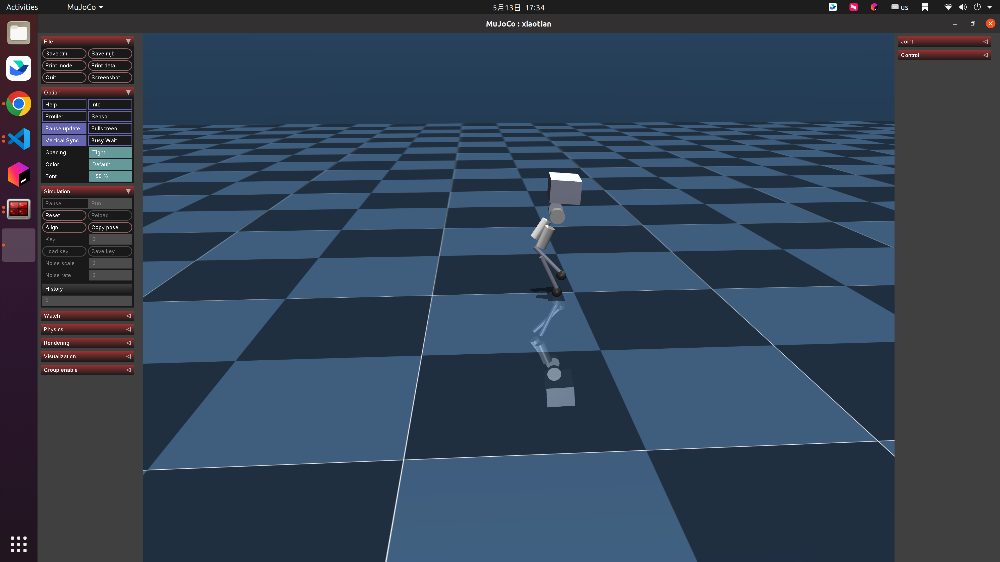

# Project: State Estimation of Biped robot

## Env settings

Install the essential packages:

```bash
pip install torch
pip install hydra-core
pip install mujoco
pip install omegaconf
```

You can run the simulation of a biped robot by the following command, then you will see that the robot move forwards in a constant speed of 1 m/s.

```bash
python biped_robot_sim.py
``` 



## Task

We have already learned Kalman Filter and some advanced version of KF, now you should try to use it in real robotics task. The given biped robot controller need **floating base velocity** as RL policy input, you need to implement the `def estimate_base_lin_vel(self)` function, which will return the estimated `base_lin_vel`.

If `USE_SIM` is True, robot will directly use the linear velocity catched from mujoco, and the biped robot will work well. You should let the robot move like that when using your own state estimator, after changing `USE_SIM` to `False`.

The information you might need is given in the function, like the contact information, joint positions, joint velocities, angular acceleration and linear acceleration. Mujoco provides the simulated IMU decleared in `xml` file.

```python
def estimate_base_lin_vel(self):
    """Estimate the base linear velocity."""
    
    # Information you might need for doing state estimation
    contact_info = (
        self.get_contact()
    )  # [left_c, right_c] 1 is contact, 0 is off-ground
    qpos_, qvel_ = (
        self.get_joint_state()
    )  # [left_abad, left_hip, left_knee, right_abad, right_hip, right_knee]
    ang_acc, lin_acc = self.data.sensor("imu_gyro"), self.data.sensor("imu_acc")

    if USE_SIM:
        return self.data.qvel[:3]
    else:
        return np.zeros(
            3
        )  # TODO: implement your codes to estimate base linear velocity
```


```xml
<sensor>
    <gyro name="imu_gyro" site="imu" noise="0.02"/>
    <accelerometer name="imu_acc" site="imu" noise="0.02"/>
    <framequat name="imu_quat" objtype="site" objname="imu" noise="0.02"/>
</sensor>
```

**Tips:**
You need first derive the State Space Model of this biped robot. It might be helpful refering to the repo of [Cheetah-Software](https://github.com/mit-biomimetics/Cheetah-Software/blob/c71c5a138d3e418cc833e94e25357ceea8955daa/common/src/Controllers/PositionVelocityEstimator.cpp#L13). Then you can implement the KF with the model, and try to finish the `estimate_base_lin_vel` function.